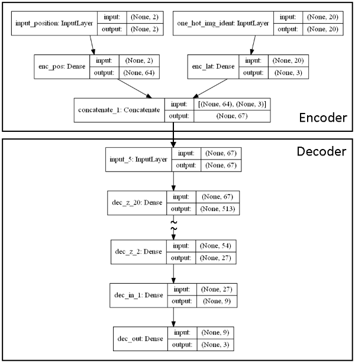
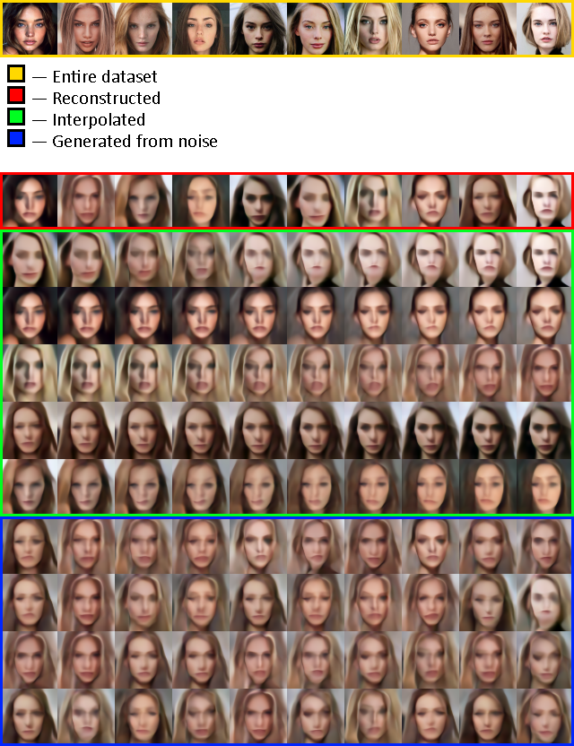

# Continuous-Image-Autoencoder
Deep learning image generator that not depends on image resolution


#### How to use:  
You should provide path to dataset file and number of examples in it to train new model, like so:
```
CIA.py -f cars.png -e 20
```
In dataset image there should be 10 pictures in row and as many rows as you want. By default each picture individually expect to have 200x200 resolution, but you can change it through "size" parameter in script if it's necessary.
If you want to generate new images with pretrained model just add "--no-train" parameter.  
Be patient while image generating, its might take quite a time.

#### Model structure:  
  

#### Results example:

You will find more examples in folders in "out.png" files.
